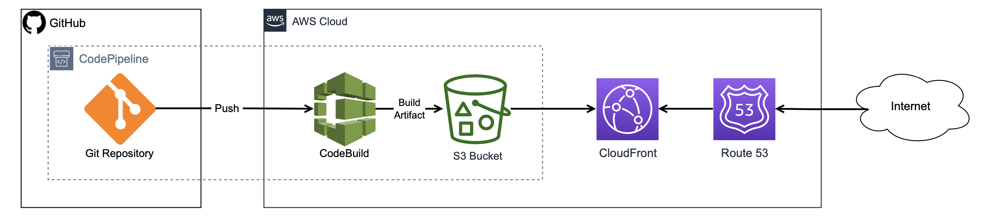
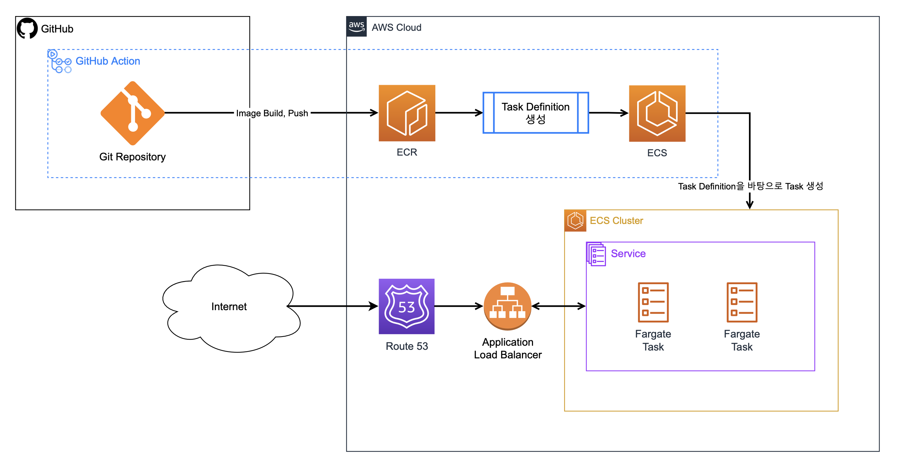

# devops-01-P2-TeamA
# **프로젝트 2: AWS 배포 자동화**

## **목표**

- 주어지는 yaml로 정리된 API 문서를 EC2에 쉘스크립트(shell script)를 통해 배포하고, 참고 할 수 있도록 합니다.
    - 참조 키워드는 다음과 같습니다.
    swagger editor, redoc-cli, docker, nginx, ssh, scp
- 주어진 API 문서를 참고하여, mongoDB를 이용한 백엔드 구현 및 API 서버를 개발합니다.
- 서버 애플리케이션을 Docker Image로 빌드하여 컨테이너화합니다.
    - 컨테이너화 할 때 db 접속 정보 및 포트 구성은 환경설정으로 분리할 수 있어야 합니다.
- 컨테이너화한 서버 애플리케이션을 Repository에 Push해야 합니다.
    - 최소한 세 번 이상의 릴리즈가 있어야 합니다.
    - 이 과정을 자동화할 수 있어야 합니다.
- 서버 애플리케이션 이미지, mongoDB 이미지를 ECS로 배포해야 합니다.
    - 서버 배포를 자동화해야 합니다.
- 제공되는 프론트엔드를 빌드합니다.
    - 빌드 및 S3로의 배포를 자동화해야 합니다.
- Docker Compose 구성을 ECS 상에서 실행할 수 있도록, Docker Compose 파일을 작성해야 합니다.
- 백엔드에 로드밸런서 및 HTTPS를 적용해야 합니다.
- CloudFront와 프론트엔드가 담긴 S3 버킷을 연결하고, HTTPS를 적용해야 합니다.
- Route 53으로 CloudFront와 로드밸런서를 각각 연결해야 합니다.

## **프론트엔드 배포**

GitHub Action → S3

## **백엔드 배포**
GitHub Action + ECR → ECS

